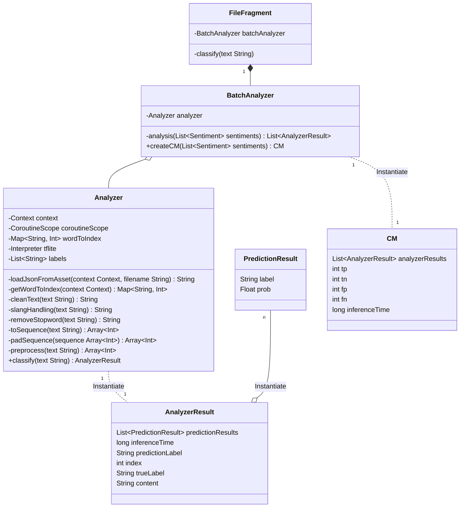

```mermaid
classDiagram
    class FileFragment{
        -BatchAnalyzer batchAnalyzer
        -classify(text String)
    }
    
    class Analyzer {
        -Context context
        -CoroutineScope coroutineScope
        -Map~String, Int~ wordToIndex
        -Interpreter tflite
        -List~String~ labels
        -loadJsonFromAsset(context Context, filename String) String
        -getWordToIndex(context Context) Map~String, Int~ 
        -cleanText(text String) String
        -slangHandling(text String) String
        -removeStopword(text String) String
        -toSequence(text String) Array~Int~
        -padSequence(sequence Array~Int~) Array~Int~
        -preprocess(text String) Array~Int~
        +classify(text String) AnalyzerResult
    }

    class BatchAnalyzer{
        -Analyzer analyzer
        -analysis(List~Sentiment~ sentiments) List~AnalyzerResult~
        +createCM(List~Sentiment~ sentiments) CM
    }
    
    class PredictionResult{
        String label
        Float prob
    }
    
    class AnalyzerResult{
        List~PredictionResult~ predictionResults
        long inferenceTime
        String predictionLabel
        int index
        String trueLabel
        String content
    }

    class CM{
        List~AnalyzerResult~ analyzerResults
        int tp
        int tn
        int fp
        int fn
        long inferenceTime
    }


    FileFragment "1" *--  BatchAnalyzer
    BatchAnalyzer "1" o-- Analyzer
    BatchAnalyzer "1" .. "1" CM : Instantiate 
    Analyzer "1" .. "1" AnalyzerResult : Instantiate 
    PredictionResult "n" --o "1" AnalyzerResult : Instantiate
```